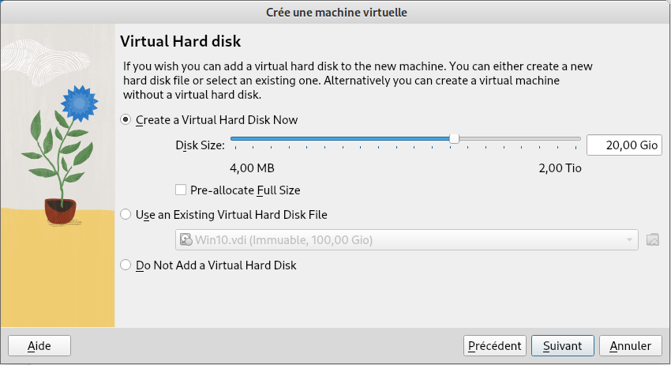
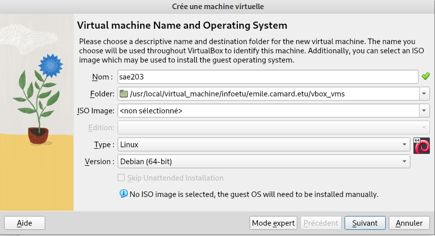
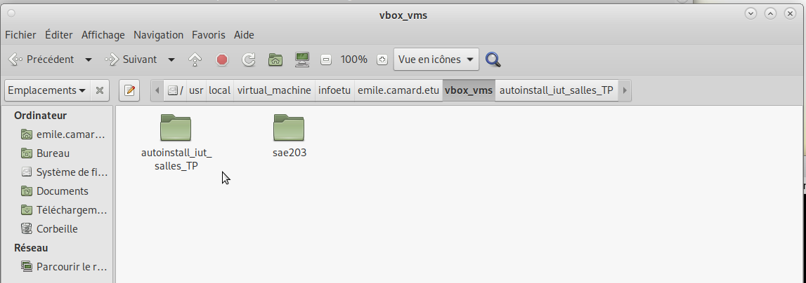
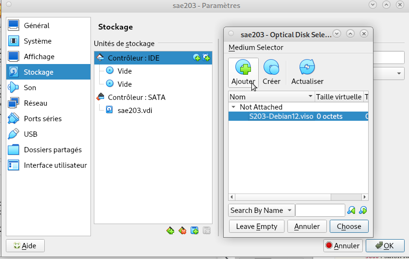
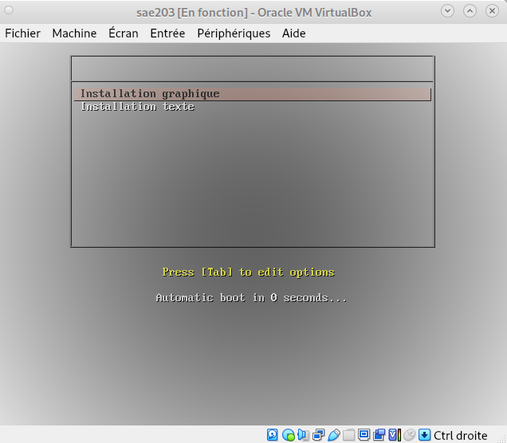
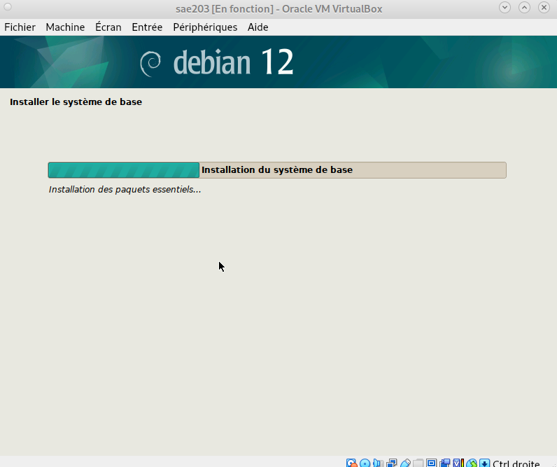

#  **Rapport technique SAE 2.03**

**Équipe chargée du projet:**  
Enzo Dewame : enzo.dewame.etu@univ-lille.fr  
Emile Camard : emile.camard@univ-lille.fr  
Elyas Rabhiu : elyas.rabhiu@univ-lille.fr

***

# La préparation de la machine virtuelle

## Présentation de la réalisation de la VM

Dans cette première étape, nous avons mis en place une machine virtuelle sous `Debian`, équipée de l’environnement graphique `MATE`. Cette installation a été réalisée de manière `classique`, afin de bien revoir chaque étape du processus d’installation du système d’exploitation. Cette démarche nous permet de mieux comprendre les bases nécessaires à l’automatisation de l’installation par la suite.

**Objectifs :**

- Installer `Debian` sur une machine virtuelle.
- Ajouter `au moins deux utilisateurs`.
- Installer quelques `logiciels de base`.

Si des difficultés ont été rencontrées lors de l’installation, nous avons pu nous référer au `guide officiel Debian`, qui détaille précisément chaque étape de la procédure.

Cette première mise en place nous a servi de référence pour comparer et mieux comprendre les gains apportés par une `installation automatisée `faites ultérieurement. 

## Étape 1 Les prérequis

Pour réaliser ce TP il suffit de posséder VirtualBox, ou l'installer dans le cas contraire : [ Lien](https://www.virtualbox.org/wiki/Downloads)  
Pour la suite rendez vous dans Virtual Box et commencez par régler les premiers paramètres ci dessous.

| **Configuration Requise** | **Détails** |
|--------------------------|------------|
|  **Mémoire RAM** | 4 Go minimum |
|  **Espace disque** | 20 Go ou plus |
|  **Logiciel requis** | VirtualBox avec Extension Pack (`VBoxGuestAddition.iso`) installé sur la machine hôte |



## Étape 2 La préparation de la machine virtuelle

Premierement il suffit de démarrer VirtualBox via l’interface graphique et créer une machine virtuelle en remplissant pas à pas les
caractéristiques ci-dessous.

| **Caractéristique**        | **Détail** |
|----------------------------|-----------|
|  **Nom de la machine**    | `sae203` |
|  **Dossier de la machine** | `/usr/local/virtual_machine/infoetu/login` (remplacer `login` par votre identifiant) |
|  **Type**                 | Linux |
|  **Version**              | Debian 64-bit (Debian 12 64-bit possible) |
|  **Mémoire vive (RAM)**   | 2048 Mo (2 Go) |
|  **Disque dur**           | 20 Go (une seule partition, **ne pas** cocher "Pre-allocate Full Size") |
|  **Installation**         | Cocher `Skip Unattended Installation` pour éviter les actions automatiques de VirtualBox |
|  **Autres paramètres**    | Laisser le reste par défaut |



## Étape 3 Le démarrage et l'installation de l'OS

Pour cette installation classique il nous faudra nous procurer un ISO bootable d'une installation de `debian 12 `, pour se faire veuillez vous rendre sur le lien ci-dessous et `télecharger l'ISO` a partir du site de réference. [ Lien](https://www.virtualbox.org/wiki/Downloads)

Après cela fait rentrez l'ISO trouvé plus tôt dans le `lecteur de cdrom` dans les paramètres de votre machines puis `lancez votre machine` et finalement **suivez les instructions ci-dessous**.

| **Caractéristique**                      | **Détails**                                      |
|------------------------------------------|-------------------------------------------------|
| **Nom de la machine (à l'installation)** | serveur                                         |
| **Domaine**                              | (Laisser vide)                                  |
| **Pays/langue**                          | France                                          |
| **Miroir**                               | <http://debian.polytech-lille.fr>              |
| **Proxy**                                | Pas de proxy                                   |
| **Compte administrateur**                | root / root                                    |
| **Un compte utilisateur**                | User / user / user                             |
| **Partition**                            | 1 seule partition de la taille du disque       |
| **Sélection des logiciels de démarrage** |                                                 |
|  Environnement de bureau Debian      | Oui                                            |
|  MATE (penser à décocher Gnome)      | Oui                                            |
|  Serveur web                         | Oui                                            |
| Serveur SSH                         | Oui                                            |
|  Utilitaires usuels du système       | Oui                                            |
                                                          
## Étape 4 La préparation du système

### L'accès sudo pour user

Dans le cadre de cette installation, nous avons `ajouté l'accès sudo` pour l'utilisateur user afin de faciliter la gestion quotidienne du système. Cela nous permet d'`exécuter des commandes nécessitant des privilèges administratifs` sans avoir à se connecter directement en tant que `root`, ce qui est à la fois `plus pratique et sécurisé`, car nous évitons de rester connecté en tant qu'administrateur par défaut.

Pour ajouter l'accès `sudo`suivez donc ces étapes:

**Passer en mode console**

```bash
Ctrl+Alt+F1
```

(si cela vous met en pleine écran, vous n’êtes pas dans la
console de la machine virtuelle)

**Se connecter en root** :

| **Information**  | **Détails** |
|--------------|---------|
| **Login**        | root    |
| **Mot de passe** | root    |

**Ajouter le groupe sudo a l'utilisateur principal, ici user**
La `commande utilisée `est :

```bash
sudo usermod -aG <nom_du_groupe> <nom_utilisateur>
```

### Les suppléments invités

Nous avons ajouté les suppléments invités pour `améliorer l'intégration de la machine virtuelle avec l'hôte`. Ils permettent d'`optimiser la résolution d'écran`, `le partage de dossiers`, et la`gestion des périphériques USB,`facilitant ainsi l'interaction et les `transferts de fichiers entre les deux systèmes.`

Voici les instructions de `comment les ajouter`:

Premierement insérez le cd des suppléments : **Périphériques > Insérer l'image CD des additions invités.**
Deuxiémement montez le CD :

```bash
sudo mount /dev/cdrom /mnt
```

Installer les suppléments:

```bash
sudo /mnt/VBoxLinuxAdditions.run 
```

Pour finir **relancez** et **connectez vous** avec le compte user pour vérifier que cela à bien fonctionné.
Pour tester si cela a fonctionné vérifiez en redimensionnant votre fenêtre.

## Partie 1 : Configuration matérielle dans VirtualBox

### 1.1. Que signifie "64-bit" dans "Debian 64-bit" ?

→ Cela signifie que le système d’exploitation installé est conçu pour les `architectures processeur 64 bits `, ce qui permet une meilleure `gestion de la mémoire ` et des `performances accrues `par rapport aux systèmes 32 bits.

|               |         |
|---------------|---------|
|  Références | [ Lien](https://www.debian.org/ports/amd64/index.fr.html) |
|               |         |

### 1.2. Configuration réseau utilisée par défaut

Par défaut, `VirtualBox ` configure les machines virtuelles avec un mode de réseau `"NAT"` .

|               |         |
|---------------|---------|
|  Références | [ Lien](https://www.informatiweb.net/tutoriels/informatique/virtualisation/virtualbox-modes-d-acces-reseau-d-une-machine-virtuelle.html) |
|               |         |

### 1.3. Fichier XML contenant la configuration de la machine

→ Le fichier `XML` contenant la configuration de la machine virtuelle se trouve dans le `dossier de configuration de VirtualBox `et porte le nom `"sae203.vbox" `.

|               |         |
|---------------|---------|
|  Références | [ Lien](https://www.informatiweb.net/tutoriels/informatique/virtualisation/virtualbox-modes-d-acces-reseau-d-une-machine-virtuelle.html) |
|               |         |

### 1.4. Modification du fichier XML pour ajouter un processeur

→ Oui, il est possible de modifier ce fichier XML en `éditant `la section :
```bash
<CPU count="2">
```
## Partie 2 : Installation OS de base

<a name="question-2-installation-os-de-base"></a>

### 2.1. Qu'est-ce qu'un fichier ISO bootable ?

Un fichier `ISO bootable `est une `image disque `qui contient une `copie exacte d'un système de fichiers` pouvant être démarrée sur un ordinateur. Il permet d'installer un `système d'exploitation` ou un `logiciel` directement à partir de l'image ISO.

|               |         |
|---------------|---------|
|  Références | [ Lien](https://www.ionos.fr/digitalguide/serveur/know-how/quest-ce-quun-fichier-iso/) |
|               |         |

### 2.2. Qu'est-ce que MATE ? GNOME ?

`MATE` et `GNOME` sont deux environnements de bureau utilisés sur les systèmes Linux.MATE est un fork de GNOME 2, `léger` et adapté aux anciennes machines. GNOME, quant à lui, est un environnement `moderne et plus gourmand` en ressources, souvent utilisé par défaut dans Debian.

|               |         |
|---------------|---------|
|  Références | [ Lien](https://wiki.debian.org/fr/MATE) |
|               |         |

### 2.3. Qu'est-ce qu'un serveur web ?

Un serveur web est un `logiciel qui héberge des pages web` et les met à disposition des utilisateurs via le protocole `HTTP`. Il répond aux requêtes des navigateurs web et sert des fichiers HTML, images, vidéos, etc., aux clients qui en font la demande.

|               |         |
|---------------|---------|
|  Références | [ Lien](https://fr.wikipedia.org/wiki/Serveur_web) |
|               |         |

### 2.4. Qu'est-ce qu'un serveur SSH ?

Un serveur SSH (Secure Shell) permet une `connexion sécurisée à distance` à un système informatique. Il utilise des techniques de cryptage pour assurer la `confidentialité` et l'`intégrité `des données échangées entre le client et le serveur.

|               |         |
|---------------|---------|
|  Références | [ Lien](https://fr.wikipedia.org/wiki/Secure_Shell) |
|               |         |

### 2.5. Qu'est-ce qu'un serveur mandataire ?

Un serveur mandataire (ou proxy) `sert d'intermédiaire` entre un utilisateur et un autre serveur. Il peut être utilisé pour `améliorer la sécurité`, la `confidentialité` ,et la gestion du trafic réseau, en filtrant ou en cachant certaines informations.

|               |         |
|---------------|---------|
|  Références | [ Lien](https://fr.wikipedia.org/wiki/Proxy) |
|               |         |

***

## Partie 3 : sudo

### 3.1. Comment savoir à quels groupes appartient l’utilisateur `user` ?

<a name="sudo"></a>
Pour savoir à quels groupes appartient l'utilisateur `user`, il suffit d'exécuter la commande suivante dans le terminal :

```bash
groups user
```

|               |         |
|---------------|---------|
|  Références | [ Lien](https://forum-debian.fr/wiki/Commandes_utilisateurs_et_groupes) |
|               |         |

## Partie 4 : Suppléments invité

### 4.1. Quelle est la version du noyau Linux utilisé par votre VM ?

→ Pour connaître la` version du noyau utilisé`, utilisez la commande :

```bash
uname -r
```

|               |         |
|---------------|---------|
|  Références | [ Lien](https://manpages.debian.org/bookworm/coreutils/uname.1.en.html) |
|               |         |

### 4.2.À quoi servent les suppléments invités ? Donnez 2 principales raisons de les installer ?

→ Les suppléments invités dans VirtualBox sont des `outils permettant d'améliorer l'intégration entre l'hôte et la machine` virtuelle. Voici deux raisons principales pour les installer :

- L’`amélioration des performances graphiques` et la `redimension automatique de l’écran`.
- L’`activation du partage de fichiers` entre l’hôte et la machine virtuelle.

|               |         |
|---------------|---------|
|  Références | [ Lien](https://packages.debian.org/bookworm/virtualbox-guest-additions-iso) |
|               |         |

### 4.3 À quoi sert la commande mount (dans notre cas et en général) ?

→ La commande mount est utilisée pour monter un système de fichiers.

Dans notre cas :

- Elle permet d’`accéder au CD des suppléments invités`.

Dans le cas général:

- Elle permet de `monter des disques` ou partitions sur un répertoire du système.

|               |         |
|---------------|---------|
|  Références | [ Lien](https://manpages.debian.org/bookworm/mount/mount.8.en.html) |
|               |         |

## Partie 5 : À propos de la distribution Debian

### 5.1 Qu’est-ce que le Projet Debian ? D’où vient le nom Debian ?

→ Le projet Debian est une communauté de développeurs qui maintient une distribution Linux libre et `open-source`.

→ Le nom "Debian" vient de la combinaison des prénoms de son fondateur `Ian Murdock` et de sa femme `Debra`.

|               |         |
|---------------|---------|
|  Références | [ Lien](https://www.debian.org/doc/manuals/debian-faq/basic-defs.fr.html#gnu) |
|               |         |

### 5.2 Quelles sont les durées de prise en charge des versions Debian ?

- Support standard : `3 ans`
- Support LTS (Long Term Support) : `5 ans`
- Support ELTS (Extended Long Term Support) :`10 ans`(réservé aux clients payants).

|               |         |
|---------------|---------|
|  Références | [ Lien](https://www.debian.org/releases/index.fr.html) |
|               |         |

### 5.3 Pendant combien de temps les mises à jour de sécurité seront-elles fournies ?

→ En général, `au moins 5 ans` après la sortie de la version stable (via LTS).

|               |         |
|---------------|---------|
|  Références | [ Lien](https://www.debian.org/doc/manuals/debian-handbook/sect.release-lifecycle.fr.html) |
|               |         |

### 5.4 Combien de versions au minimum sont activement maintenues par Debian ? Donnez leur nom générique.

- Stable (actuelle : `Debian 12 "Bookworm`")
- Testing (futur `Debian 13 "Trixie"`)
- Unstable (nommée `"Sid"`)

|               |         |
|---------------|---------|
|  Références | [ Lien](https://wiki.debian.org/fr/DebianReleases) |
|               |         |

### 5.5 D’où viennent les noms de code donnés aux distributions Debian ?

→ Les noms de code des versions Debian proviennent des personnages du film `"Toy Story"` (ex. : Buzz, Woody, Jessie, Bookworm).

|               |         |
|---------------|---------|
|  Références | [ Lien](https://www.debian.org/doc/manuals/project-history/releases.fr.html) |
|               |         |

### 5.6 Combien et quelles architectures sont prises en charge par Debian Bullseye ?

→ 9 architectures :

1. amd64
2. i386
3. arm64
4. armel
5. armhf
6. mips
7. mipsel
8. mips64el
9. ppc64el

|               |         |
|---------------|---------|
|  Références | [ Lien](https://www.debian.org/releases/bullseye/amd64/ch02s01.fr.html#idm195) |
|               |         |

### 5.7 Première version avec un nom de code

- Premier nom de code : `Buzz`
- Date d’annonce : `17 juin 1996`
- Numéro de version :` Debian 1.1`

|               |         |
|---------------|---------|
|  Références | [ Lien](https://www.debian.org/doc/manuals/project-history/releases.fr.html) |
|               |         |

### 5.8 Dernier nom de code attribué

- Dernière version annoncée :` Debian 13 "Trixie"`
- Date d’annonce : `2023`
- Numéro de version : `Debian 13 (Testing)`

|               |         |
|---------------|---------|
|  Références | [ Lien](https://www.debian.org/doc/manuals/project-history/releases.fr.html) |
|               |         |

# Procédure d'auto-installation

## Introduction 

Cette procédure explique comment `réaliser une installation automatique` et `préconfigurée` de `Debian` à l'aide de l'`auto-install` disponible sur Moodle. Cela permet d'accélérer et de simplifier le processus d'installation `sans intervention manuelle`.

## Étapes d'installation

### Étape 1 Configurer une machine

Dans un premier temps comme `expliqué en première partie` nous allons configurer une machine, une fois fini nous pouvons `commencer l'auto installation`.

Premièrement `récuperez`l'archive **autoinstall_debian.zip** et `décompressez`le dans le répertoire de votre VirtualBox.

**Remarque**: Nous avons eu un problème au départ, nous avons pensé faire cette autoinstallation chez nous sans savoir qu'il fallait modifier le fichier de configuration, au final nous l'avons fait en salle TP.

Pour l’installer sur les machines de l’IUT nous avons eu besoin de la mettre en local, donc en suivant ce chemin :

```bash
/usr/local/virtual_machine/infoetu/votre_login
```

Nous pouvons voir ci dessous le chemin d'accès selon l'identifiant:



### Étape 2 Modifier le fichier de configuration

Pour cela veuillez remplacer la chaîne @@UUID@@ par un identifiant unique universel (UUID). Pour ce faire, exécutez la commande suivante dans le répertoire contenant votre fichier `S203-Debian12.viso` :

```bash
sed -i -E "s/(--iprt-iso-maker-file-marker-bourne-sh).*$/\1=$(cat /proc/sys/kernel/random/uuid)/" S203-Debian12.viso
```

### Étape 3 Configurer le lecteur optique

Pour cela premièrement insérez le fichier `S203-Debian12.viso` dans le lecteur optique (CD/DVD) de votre machine virtuelle.
Voici ce que vous devez avoir:



### Étape 4 Ajout de la partie graphique sans commande taskel

**Ajouter le droit sudo a l'utilisateur standard**:
La ligne à ajouter après la suivante `d-i passwd/make-user boolean true `est celle ci-dessous:

```bash
d-i passwd/user-default-groups string sudo
```

**Ajout des paquets demandés**:
La ligne a modifier est :`d-i pkgsel/include string ...\`\`
ajoutez cela à la place des points:

```bash
d-i pkgsel/include string sudo git sqlite3 curl bash-completion neofetch
```

**Installer l'environnement MATE**
Modifier la ligne contenant: ` tasksel tasksel/first multiselect` et ajoutez :

```bash
tasksel tasksel/first multiselect standard, mate-desktop
```

**Le démarrage et l'installation :**
Pour cela appuyez uniquement sur démarrer et laissez la machine s'exécuter automatiquement. Attendez le redémarrage, Debian sera installé sans intervention manuelle.

Voici les étapes prise rapidement:





Cette méthode permet d'installer Debian de manière automatisée et rapide. Vous pouvez maintenant utiliser votre système Debian sans avoir à effectuer les configurations initiales manuellement.

## SEMAINE 3 Analyse préliminaire de git et des outils graphiques associés

Pour le rapport de cette séance, l’objectif est de `documenter les étapes réalisées lors de l’installation` et de la `configuration de git`, ainsi que des outils graphiques associés, et de `comparer ces outils avec une autre interface graphique` choisie parmi une liste. Voici un résumé de ce qu'il faut faire et expliquer dans le rapport :

### Paramétrer git

Pour commencer ouvrez un terminal et effectuez les commandes suivantes :

```bash
git config --global user.name "Prénom Nom" 
git config --global user.email "votre@email" 
git config --global init.defaultBranch "master" 
```

Ces configurations permettent à git de nous reconnaître et de configurer la branche principale par défaut, ce qui évite des messages d'avertissement.

### Question associée a git

#### Qu’est-ce que le logiciel gitk ? Comment se lance-t-il ?

gitk est un outil graphique qui permet de visualiser l'historique des commits sous forme de graphe.
Lancer gitk :

```bash
gitk
```

#### Qu’est-ce que le logiciel git-gui ? Comment se lance-t-il ?

git-gui est une interface graphique pour effectuer des opérations git courantes (commits, gestion des branches, etc.).
Lancer git-gui :

```bash
git gui
```

### Installation et test des interfaces graphiques pour git :

#### Pourquoi avez-vous choisi ce logiciel ?

Nous avons choisi SourceTree car après avoir verifié sur internet,il offre une interface intuitive et complète pour gérer les projets git, avec une gestion facile des branches et des commits ce qui est bien pour nous comme nous sommes débutant.

#### Comment l’avez-vous installé ?

Nous avons téléchargé SourceTree depuis SourceTree et suivi les instructions d'installation pour Linux.

#### Comparaison avec gitk et la ligne de commande :

**Fonctionnalités**:
SourceTree est plus complet avec une gestion graphique des commits, branches et merges, tandis que gitk et git-gui sont plus basiques.

**Avantages** :
Interface facile à utiliser et gestion améliorée des branches.

**Inconvénients** :
Plus lourd en ressources que gitk et moins flexible que la ligne de commande.

#### tuto sourcetree

Installer SourceTree :

1. Une fois le fichier téléchargé, ouvrez un terminal et naviguez jusqu’au répertoire où le fichier a été téléchargé. Installez le paquet .tar.xz en exécutant la commande suivante :

```bash
tar -xf Sourcetree.tar.xz
```

Accédez au dossier extrait et lancez l'installateur :

```bash
cd Sourcetree
./install.sh
```

Lancer SourceTree :
Une fois l'installation terminée, vous pouvez lancer SourceTree avec la commande:

```bash
sourcetree
```

## **REMARQUE** : Ce document n'est pas terminé, il sera completé au fil des semaine dans l'avancement en autonomie.